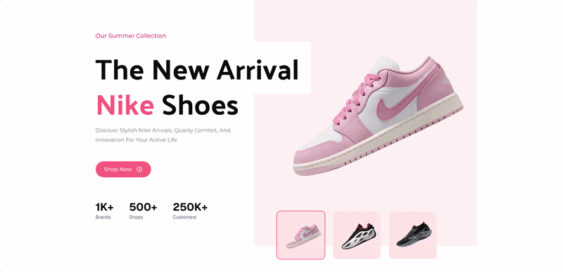

# Nike | Shop Sneakers & More

A modern, responsive web application showcasing Nike products, built with React and Tailwind CSS.

🔗 **Live Demo:** [https://portfolio-nike-app.vercel.app](https://portfolio-nike-app.vercel.app)  
🌐 **Portfolio:** [https://aymenghris.vercel.app](https://aymenghris.vercel.app)  

📸 Preview

## ✨ Key Features
- **Clean Component Architecture:** Highly modular React structure utilizing Radix UI primitives and shadcn for reusable, accessible UI elements.
- **Utility-First Styling & Variants:** Advanced styling with Tailwind CSS v4, leveraging `class-variance-authority` (cva) and `tailwind-merge` for predictable and dynamic class management.
- **Optimized Asset Delivery:** Performant, responsive image rendering using `@unpic/react` to ensure fast load times and excellent Core Web Vitals.
- **Type-Safe Codebase:** Strict static typing with TypeScript and lightning-fast formatting/linting powered by Biome for a robust development experience.

## 🛠 Tech Stack
- **Frontend:** `React 19`, `Tailwind CSS v4`, `Vite`, `TypeScript`
- **Deployment:** `Vercel`

## 👤 Contact
[LinkedIn](https://linkedin.com/in/aymenghris) • [Email](mailto:aymenghris@outlook.com) • [GitHub](https://github.com/aymenghris)
